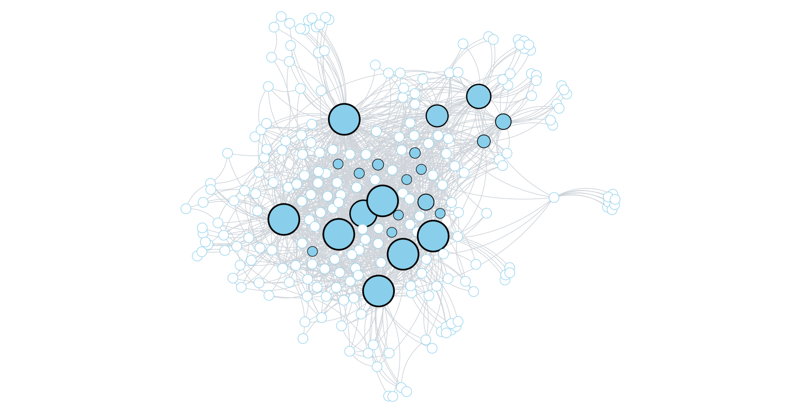

# CP-Explainer: A Visualization Tool for Core-Periphery Analysis

<p align="center">
  
  <br/>
  <i>Figure 1: Example of CP-Explainer Visualization</i>
</p>

**CP-Explainer** is a web-based interactive system designed to simplify and enhance the analysis of core-periphery (CP) structures in networks. It provides an integrated analytical environment with intuitive visualizations, detailed algorithm explanations, and no-code interaction, making CP analysis accessible for users of all expertise levels.

🎥 [Watch the Demo Video](https://youtu.be/GAMnm-1YHw8)  
🚀 [Access the Live Demo](http://34.64.91.195/)

---

## Features

### Key Features

#### 1. **Network Visualization with Multiple Data Formats**

#### 2. **Application of Core-Periphery Algorithms**

#### 3. **Detailed Panels for Comprehensive Analysis**

#### 4. **User-Friendly Features**

---

## Requirements

- Python 3.9.2
- Conda
- React with TypeScript

---

## Installation

1. **Clone the Repository**
   ```bash
   git clone https://github.com/JJEliPark/cp-explainer.git
   ```
2. **Set up Python Environment**

   ```bash
   conda create -n cp-explainer python=3.9.20
   conda activate cp-explainer
   pip install -r requirements.txt
   ```

3. **Install React TypeScript Dependencies**
   ```bash
    cd cp-exp
    npm install
    cd ..
   ```

## Usage

1. **Start the Uvicorn Server**
   ```bash
    cd app
    uvicorn main:app --reload
   ```
2. **Start the React Frontend**
   ```bash
    cd cp-exp
    npm start
   ```

## Feedback and Contributions

We welcome feedback and suggestions for improving CP-Explainer. Feel free to open issues or contribute enhancements through pull requests.

---

## License

This project is licensed under the terms of the Creative Commons Attribution License.
